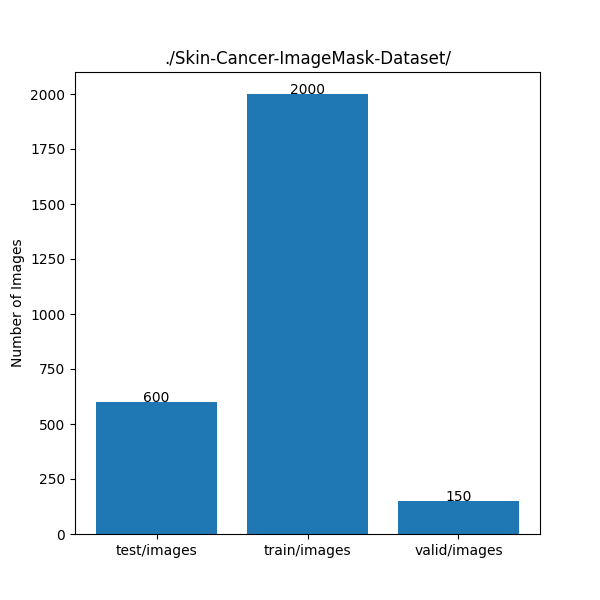
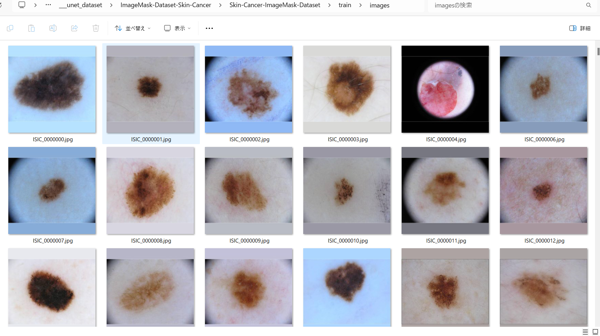
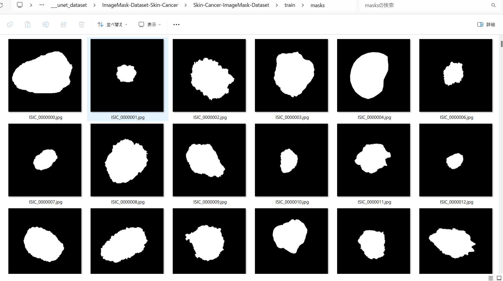

<h2>ImageMask-Dataset-Skin-Cancer (2024/03/17) 
</h2>
This is a Skin-Cancer ImageMask Dataset for Image-Segmentation. 
Please see also our first experiment <a href="https://github.com/sarah-antillia/Image-Segmentation-Skin-Lesion">Image-Segmentation-Skin-Lesion</a> 
 

<h3>1. Dataset Citation</h3>

The image dataset used here has been taken from the following web site. 

<pre>
ISIC Challenge Datasets 2017
https://challenge.isic-archive.com/data/
</pre>

<b>Citing 2017 datasets:</b>
<pre>
Codella N, Gutman D, Celebi ME, Helba B, Marchetti MA, Dusza S, Kalloo A, Liopyris K, Mishra N, Kittler H, Halpern A.
 "Skin Lesion Analysis Toward Melanoma Detection: A Challenge at the 2017 International Symposium on Biomedical Imaging (ISBI),
  Hosted by the International Skin Imaging Collaboration (ISIC)". arXiv: 1710.05006 [cs.CV]
</pre>
<b>License: CC-0</b> 
 
See also: 

<a href="https://paperswithcode.com/dataset/isic-2017-task-1">ISIC 2017 Task 1</a> 
<pre>
Introduced by Codella et al. in Skin Lesion Analysis Toward Melanoma Detection: 
A Challenge at the 2017 International Symposium on Biomedical Imaging (ISBI), 
Hosted by the International Skin Imaging Collaboration (ISIC)
</pre>
<pre>
The ISIC 2017 dataset was published by the International Skin Imaging Collaboration (ISIC) as a large-scale dataset 
of dermoscopy images. The Task 1 challenge dataset for lesion segmentation contains 2,000 images for training with 
ground truth segmentations (2000 binary mask images).
</pre>
 

<h3>
2. Download master dataset
</h3>
  Please download the original Test, Train, Valid image and mask dataset <b>ISIC Challenge Datasets 2017</b> from the following link 

<pre>
ISIC Challenge Datasets 2017
https://challenge.isic-archive.com/data/
</pre>

The dataset <b>ISIC-2017</b> has the following folder structure. 

<pre>
./ISIC-2017
├─ISIC-2017_Test_v2_Data
├─ISIC-2017_Test_v2_Part1_GroundTruth
├─ISIC-2017_Training_Data
├─ISIC-2017_Training_Part1_GroundTruth
├─ISIC-2017_Validation_Data
└─ISIC-2017_Validation_Part1_GroundTruth
</pre>
Image  *_Data folders contain jpg image files of various size from 1K to 4K, and mask dataset *_GroundTruth 
folders contain the segmention png files corresponding to the images in *_Data folders.

<h3>
3. Create ImageMask Ddataset
</h3>
<h3>
3.1 Create image and mask dataset
</h3>
By using Python script <a href="./generator/ImageMaskDatasetGenerator.py">ImageMaskDatasetGenerator.py</a>,
 we have created <b>Skin-Cancer-ImageMask-Dataset</b> from the original jpg image files in <b>*_Data</b> folders and png mask files in 
 <b>*_GroundTruth</b> folders. 
The script performs the following image processings. 
<pre>
1 Create 512x512 square images from original image files.
2 Create 512x512 square mask  corresponding to the image files. 
</pre>

The created <b>Skin-Cancer-ImageMask-Dataset</b> has the following folder structure. 
<pre>
./Skin-Cancer
├─test
│  ├─images
│  └─masks
├─train
│  ├─images
│  └─masks
└─valid
    ├─images
    └─masks
</pre>

<b>Dataset Statistics</b> 
 

<b>train/images samples:</b> 

 
<b>train/masks samples:</b> 

 

